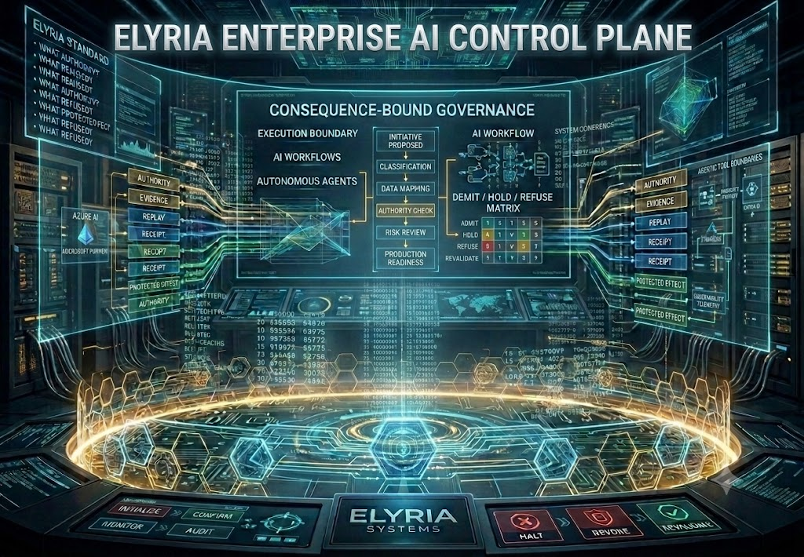

<div align="center">

# Elyria Enterprise AI Control Plane

## Responsible AI · Agentic Governance · Azure Reference Architecture · Production Movement Control




### **Govern AI movement before production consequence.**


</div>

---

## What This Solves

Enterprises are adopting AI faster than their governance, security, privacy, data, and architecture functions can consistently control it.

AI programs often begin as pilots, copilots, RAG assistants, automation experiments, agentic workflows, or AI-assisted development patterns. The risk appears when those systems begin influencing real decisions, retrieving sensitive data, calling tools, changing workflows, generating customer-facing output, or moving toward production before the organization has resolved ownership, authority, data scope, evaluation, observability, and revalidation.

The Elyria Enterprise AI Control Plane provides a structured operating model for that gap.

It helps an enterprise decide whether an AI system, workflow, agent, model integration, RAG pattern, Copilot extension, or automation path should advance, pause, stop, or return for review before it creates operational consequence.

---

## Why Enterprises Benefit

This repository turns responsible AI from policy language into an architecture and delivery pattern.

Enterprise teams gain:

- a common decision model for AI movement
- a repeatable intake and review structure
- clearer ownership across business, technical, security, privacy, data, and AI teams
- stronger production-readiness discipline
- reusable architecture artifacts for client delivery and internal governance
- a sandbox model for pilot evaluation before production escalation
- a revalidation model for changed data, model, prompt, tool, policy, or environment conditions
- executive-ready language for CIO, CISO, CTO, data, AI, privacy, and risk leaders

The business value is practical: faster AI adoption with stronger control over what is allowed to move, what must pause, what must be refused, and what must be revalidated.

---

## Executive Thesis

Enterprise AI does not fail only because a model gives a bad answer.

It fails when model output, data movement, agentic tool use, identity access, or automation advances into production consequence before architecture has resolved whether that movement is authorized, governed, observable, reversible, and safe.

The **Elyria Enterprise AI Control Plane** is a public-safe, pilot-ready sandbox architecture for governing AI movement across the enterprise lifecycle:

```text
idea → discovery → classification → authority → data scope → model/RAG/agent controls → evaluation → production readiness → deployment → telemetry → revalidation
```

It is designed as a **Principal Architect-level asset**: executive-readable, delivery-usable, reusable across accounts, and structured for Azure AI, Microsoft Purview, Entra ID, Azure OpenAI, Azure AI Search, Databricks, CI/CD, observability, responsible AI, agentic systems, and sandbox deployment readiness.

---

## Pilot-Ready Sandbox Playground

This repository includes a deployment-oriented sandbox model for showing how enterprise AI movement can be evaluated before production advancement.

The playground is designed for:

- AI governance discovery
- agentic workflow review
- RAG production-readiness review
- data-scope and authority mapping
- responsible AI control validation
- executive stakeholder demos
- pilot corridor planning
- reusable client workshop assets

Sandbox outcome model:

```text
ADMIT      AI movement may advance.
HOLD       Required evidence or control coverage is incomplete.
REFUSE     Movement is blocked because protected consequence could bind without adequate control.
REVALIDATE Conditions changed; prior approval cannot be relied on.
```

---

## End-to-End Coverage

| Layer | Enterprise Question | Repository Asset |
|---|---|---|
| Executive discovery | What AI capability is being pursued and why? | `docs/executive-workshop.md` |
| Use-case classification | What kind of AI movement is being proposed? | `docs/ai-governance-decision-framework.md` |
| Data scope | What data is used, retrieved, generated, stored, or exposed? | `docs/control-matrix.md` |
| Identity and authority | Who or what is allowed to access, approve, deploy, or trigger action? | `docs/reference-architecture.md` |
| Agentic systems | What tools can be called and what action can bind? | `docs/agentic-systems-control-model.md` |
| RAG readiness | Are retrieval sources approved, grounded, evaluated, and observable? | `docs/rag-production-readiness.md` |
| Azure alignment | How does the model map to Azure AI, Purview, Entra, OpenAI, AI Search, and observability? | `docs/azure-alignment.md` |
| Architecture decisions | What was decided, why, by whom, and under what assumptions? | `docs/architecture-decision-record-template.md` |
| Pilot sandbox | How is an AI use case evaluated before production advancement? | `sandbox/deployment-playground.md` |
| Stakeholder credibility | Why is this serious architecture work? | `docs/credibility-map.md` |

---

## Credibility Layer

This repository is structured around artifacts expected in serious enterprise architecture work:

- reference architecture
- executive workshop model
- control matrix
- architecture decision record template
- Azure alignment layer
- agentic systems control model
- RAG production-readiness model
- pilot sandbox scenarios
- public-safe license and notice boundary
- credibility map for stakeholder review

---

## Core Question

> **What AI movement is allowed to advance, under what authority, with what data scope, with what controls, and what must stop before risk becomes operational consequence?**

---

## Architecture Flow

```text
AI initiative proposed
        ↓
Use-case classification
        ↓
Data scope + sensitivity mapping
        ↓
Identity / access / authority check
        ↓
Model + RAG + agent/tool risk review
        ↓
Security, privacy, compliance, observability controls
        ↓
Evaluation and production readiness
        ↓
ADMIT / HOLD / REFUSE / REVALIDATE
        ↓
Deployment only if governed
        ↓
Telemetry + drift + incident feedback
        ↓
Revalidation
```

---

## Decision Outcomes

| Outcome | Meaning |
|---|---|
| **ADMIT** | AI movement may advance because authority, scope, controls, evaluation, and observability are present. |
| **HOLD** | AI movement is not refused, but required evidence, control coverage, or readiness is incomplete. |
| **REFUSE** | AI movement may not advance because required controls, authority, safety, or governance are missing. |
| **REVALIDATE** | Prior approval cannot be relied on because conditions, scope, data, model, tools, or risk changed. |

---

## Public-Safe Components

| Asset | Purpose |
|---|---|
| `docs/reference-architecture.md` | Target-state enterprise AI governance architecture. |
| `docs/principal-architect-playbook.md` | Executive discovery, delivery leadership, reusable architecture assets. |
| `docs/ai-governance-decision-framework.md` | ADMIT / HOLD / REFUSE / REVALIDATE decision model. |
| `docs/agentic-systems-control-model.md` | Tool-use boundaries, approval, escalation, monitoring, and revalidation. |
| `docs/rag-production-readiness.md` | Source authority, grounding, access control, evaluation, and telemetry. |
| `docs/azure-alignment.md` | Azure OpenAI, Purview, Entra ID, AI Search, Databricks, CI/CD, observability. |
| `docs/executive-workshop.md` | 90-minute CIO / CISO / Data / AI leader discovery workshop. |
| `docs/architecture-decision-record-template.md` | ADR template for governed AI architecture decisions. |
| `docs/control-matrix.md` | Control matrix across identity, data, privacy, security, RAG, agents, and observability. |
| `docs/credibility-map.md` | Stakeholder-facing credibility and coverage map. |
| `sandbox/deployment-playground.md` | Pilot-ready sandbox deployment model. |
| `sandbox/sample-scenarios.md` | Demo scenarios for ADMIT / HOLD / REFUSE / REVALIDATE. |
| `examples/customer-support-copilot.json` | Example governed AI use case. |
| `examples/agentic-workflow-risk.json` | Example high-risk agentic workflow. |
| `tests/test_control_plane_logic.md` | Public-safe decision test logic. |
| `LICENSE` | MIT license. |
| `NOTICE.md` | Public-safe boundary and attribution notice. |

---

## Principal Architect Value

This repository demonstrates how to convert fragmented enterprise AI adoption into a reusable architecture asset:

- executive discovery model
- AI governance decision framework
- reference architecture
- responsible AI control model
- agent/tool-use boundary model
- RAG production-readiness model
- Azure alignment layer
- architecture decision records
- sandbox deployment model
- testable governance outcomes
- reusable delivery and pursuit pattern

---

## Public Boundary

This repository is public-safe. It demonstrates the architecture surface, sandbox logic, and pilot-readiness model, not private Elyria Systems runtime machinery, customer-specific implementation, protected validators, or commercial proof-corridor internals.

**Show the architecture. Protect the machinery.**
